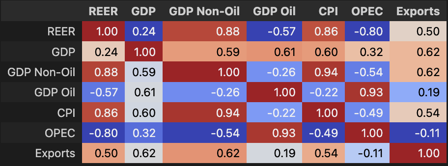
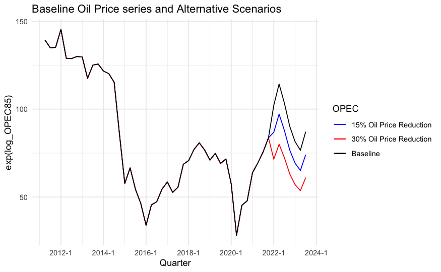

Impact of Oil Price fluctuations on Saudi Arabia’s and testing for Dutch
Disease
================
Ali Rashid
2024-10-06

**Please Note: The following is still in draft form and not fully
complete**

## Study Motivation and Overview

Saudi Arabia is making significant efforts to restructure its economy.
In 2016, the government launched Saudi Vision 2030, an initiative aimed
at diversifying the economy and reducing its heavy fiscal and output
reliance on oil. As of 2022, oil accounted for approximately 40% of the
country’s real GDP
[IMF](https://www.elibrary.imf.org/view/journals/002/2022/275/article-A001-en.xml).
This study aims to investigate how sensitive the Saudi economy remains
to oil price shocks at this critical stage in its economic
restructuring. Additionally, the study explores the phenomenon of Dutch
Disease — where rising oil demand/prices appreciates the domestic
currency, negatively impacting non-oil exports and, in turn, the non-oil
sector of the economy. Consequently, this study focuses on the following
key questions:

### 1. The impact of oil prices on real Saudi GDP

#### Estimation

An ARDL model is used to estimate the relationship between oil prices
and GDP, assessing how a 1% change in oil prices influences real GDP %
growth.

#### Scenario Analysis

Two alternative scenarios are considered: a 15% and a 30% reduction in
oil prices between 2022 and 2024. These simulations explore the
potential adverse effects of negative oil price shocks on the Saudi
economy.

### 2. The relationship between the Real Effective Exchange Rate (REER), the non-oil sector and oil prices.

This aspect of the study is explored through two separate ARDL models,
with REER and Non-Oil GDP as the dependent variables. The estimation
outputs, alongside impulse response functions, help diagnose whether
Dutch Disease is a concern for Saudi Arabia.

## Theory/Expectation

If the economy exhibits signs of Dutch Disease, we would expect to find
the following:

- Long-run equilibrium between oil prices and GDP, and potentially
  between oil prices and the REER.
- A positive relationship between the REER and oil prices when REER is
  the dependent variable, indicating currency appreciation due to oil
  price increases.
- A negative relationship between the REER and Non-Oil GDP when Non-Oil
  GDP is the dependent variable, implying that a stronger currency (due
  to oil revenues) weakens the competitiveness of the non-oil sector.

## Key findings

#### No Cointegration Found:

Both the ARDL bounds test and Johansen test failed to show long-run
equilibrium relationships between the variables, indicating a lack of a
long-term cointegrating relationships among the variables tested.

#### Oil Prices Significantly Drive GDP

A 1% increase in oil prices leads to approximately a 0.29% increase in
GDP immediately, with further lagged impacts of 0.19% and 0.07% at the
first and second lags. This indicates that oil price shocks propagate
through the economy over multiple periods.

#### Scenario Analysis Shows Substantial GDP Declines from Oil Price Reductions

The scenario analysis of 15% and 30% oil price reductions reveals
significant negative impacts on GDP. A 30% oil price reduction causes a
17% decline in GDP by 2023, whereas the 15% reduction results in a 8%
decline, confirming the Saudi economy’s sensitivity to oil price shocks.

#### Negative Relationship Between Oil Prices and REER

Oil prices are negatively related to the REER. A 1% increase in oil
prices leads to a 0.05% decrease in the REER, suggesting that other
factors may explain the depreciation of the Saudi currency rather than
appreciation as predicted by Dutch Disease theory.

#### REER Positively Impacts Non-Oil GDP

Instead of reducing non-oil sector competitiveness, REER increases are
associated with 0.73% growth in non-oil GDP after two lags.

### Result Implications

These findings indicate that Saudi Arabia remains heavily sensitive to
oil driven growth. The findings do not strongly support the presence of
Dutch Disease in the Saudi Arabian economy, at least not in the
short-to-medium term in the chosen sample. Instead of oil price
increases crowding out the non-oil sector, higher oil prices appear to
stimulate non-oil GDP growth. This likely reflects the government’s
strategic use of oil revenues (as part of Vision 2030) to support
non-oil industries and public investment.

The relationship between oil prices and the Real Effective Exchange Rate
(REER) further challenges the Dutch Disease hypothesis. While we might
expect rising oil prices to appreciate the REER (and thus harm export
competitiveness), the data show a negative relationship. One explanation
could be that Saudi Arabia’s pegged nominal exchange rate and relatively
low inflation compared to its trading partners keep the REER in check,
despite higher oil prices. This dampens the negative exchange rate
effect on the non-oil sector.

## Data and Methodology

### Data

I used 6 variables found either on the Federal Reserve Bank of St.Louis
(FRED) or the Saudi Arabia General Authority for Statistics (GASTAT).
The data is quarterly, dating from 2010 Q1 to 2023 Q3 (55 observations):

- GDP: Total Real GDP in 2020 SAR millions (GASTAT)
- Non-Oil GDP: Real GDP generated from non-oil activities, in 2020 SAR
  millions (GASTAT)
- OPEC: OPEC Basket Price in \$ per barrel (OPEC)
- Exports: Total Real Exports in 2020 SAR millions (FRED)
- REER: The Real Effective Exchange Rate (FRED)
- CPI: Consumer Price Index of Saudi Arabia, base = 2020 (GASTAT)

The variables, if found in nominal forms, were deflated using the CPI
variable. The log transformation was used for analytical
interpretability. ADF tests concluded all variables were integrated of
order 1, except `Exports`, which is stationary at the level.

### Model Selection

Error Correction Models (ECM) were the preferred option for
investigating the short and long run dynamics of the variables. However,
if no cointegration exists in the variables, the first differences of
the variables were estimated in an Autoregressive Distributed Lag (ARDL)
model. The process went as follows:

1.  Fit an ARDL model using variable levels, choosing optimal lag
    structure from information criterion.
2.  Use Pesaran et al. (2001) Bounds test and/or Johansen & Søren (1991)
    Cointegration test to see if the variables exhibited long run
    equalibrium relationships.
3.  If the null hypothesis of the tests were rejected at the 5% level of
    significance, an ECM model would be fitted using the level and first
    differences of the variables. Otherwise, the models were estimated
    using only first differenced variables in the ARDL framework.
4.  Model Diagnostics: residuals were tested for autocorrelation,
    heteroscedasticity, and normality. Finally, the models were tested
    for stability.

### Scenario Analysis

Two new variables, `OPEC85` and `OPEC70`, were created from the original
OPEC variable, where the last seven observations were reduced by 15% and
30%, respectively, compared to the actual OPEC Basket Price at the time.
The estimated model coefficients for real GDP were then used to simulate
the impact of these two negative price shock scenarios. The differences
between the simulated results and the baseline GDP series were plotted
to visualise the effects of the price shocks on the economy.

## Data Cleaning and EDA

The pre-processing, compiling the raw csv files into one dataframe,
taking logs and first differences, ADF tests, deflating variables,
removing seasonality and creating a correlation matrix of the variables,
was done in the `oil_project_SA.ipynb` python notebook.

``` r

```


The most striking relationships are that of REER and OPEC (-0.80),
Non-oil GDP and REER (0.88), OPEC and CPI (-0.49) and OPEC and GDP
(0.32). The preliminary EDA shows very different findings to my
presumptions.

The dataframe was then imported into R for the rest of data processing
and analysis.

``` r
#install.packages("dynlm")
#install.packages("urca")
#install.packages("ARDL")
#install.packages("msm")
#install.packages("tseries")
#install.packages("forecast")
#install.packages("car")
#install.packages("strucchange")
```

``` r
library(strucchange)
```

    ## Loading required package: zoo

    ## 
    ## Attaching package: 'zoo'

    ## The following objects are masked from 'package:base':
    ## 
    ##     as.Date, as.Date.numeric

    ## Loading required package: sandwich

``` r
library(car)
```

    ## Loading required package: carData

``` r
library(tidyverse)
```

    ## ── Attaching core tidyverse packages ──────────────────────── tidyverse 2.0.0 ──
    ## ✔ dplyr     1.1.1     ✔ readr     2.1.4
    ## ✔ forcats   1.0.0     ✔ stringr   1.5.0
    ## ✔ ggplot2   3.4.1     ✔ tibble    3.2.1
    ## ✔ lubridate 1.9.2     ✔ tidyr     1.3.0
    ## ✔ purrr     1.0.1

    ## ── Conflicts ────────────────────────────────────────── tidyverse_conflicts() ──
    ## ✖ stringr::boundary() masks strucchange::boundary()
    ## ✖ dplyr::filter()     masks stats::filter()
    ## ✖ dplyr::lag()        masks stats::lag()
    ## ✖ dplyr::recode()     masks car::recode()
    ## ✖ purrr::some()       masks car::some()
    ## ℹ Use the conflicted package (<http://conflicted.r-lib.org/>) to force all conflicts to become errors

``` r
library(conflicted)
library(ggplot2)
library(dplyr)
library(dynlm)
library(urca)
library(ARDL)
```

    ## To cite the ARDL package in publications:
    ## 
    ## Use this reference to refer to the validity of the ARDL package.
    ## 
    ##   Natsiopoulos, Kleanthis, and Tzeremes, Nickolaos G. (2022). ARDL
    ##   bounds test for cointegration: Replicating the Pesaran et al. (2001)
    ##   results for the UK earnings equation using R. Journal of Applied
    ##   Econometrics, 37(5), 1079-1090. https://doi.org/10.1002/jae.2919
    ## 
    ## Use this reference to cite this specific version of the ARDL package.
    ## 
    ##   Kleanthis Natsiopoulos and Nickolaos Tzeremes (2023). ARDL: ARDL, ECM
    ##   and Bounds-Test for Cointegration. R package version 0.2.4.
    ##   https://CRAN.R-project.org/package=ARDL

``` r
library(msm)
library(lmtest)
library(tseries)
```

    ## Registered S3 method overwritten by 'quantmod':
    ##   method            from
    ##   as.zoo.data.frame zoo

``` r
library(zoo)
library(forecast)
conflicted::conflicts_prefer(dplyr::lag)
```

    ## [conflicted] Will prefer dplyr::lag over any other package.

``` r
df = read.csv('metrics_data2.csv') #Read in the dataframe
df <- tibble::as_tibble(df)
df$Quarter <- as.yearqtr(df$Quarter, format = "%YQ%q")

# Create Oil price variables where last 7 periods have 15% and 30% oil reduction from baseline respectively
last_7_obs <- (nrow(df) - 6):nrow(df) 
df$log_OPEC85 <- df$log_OPEC 
df$log_OPEC85[last_7_obs] <- log(df$OPEC[last_7_obs] * 0.85)
df$log_OPEC70 <- df$log_OPEC 
df$log_OPEC70[last_7_obs] <- log(df$OPEC[last_7_obs] * 0.70)

# Create Lag and first differences of the new variables to use in the predict()
# For scenario analysis
df$L1log_OPEC85 <- lag(df$log_OPEC85, 1)    
df$dlog_OPEC85 <- c(NA, diff(df$log_OPEC85, lag = 1))             
df$dL1log_OPEC85 <- lag(df$dlog_OPEC85, 1)   
df$dL2log_OPEC85 <- lag(df$dlog_OPEC85, 2) 
df$dL3log_OPEC85 <- lag(df$dlog_OPEC85, 3) 
df$dL4log_OPEC85 <- lag(df$dlog_OPEC85, 4)


df$L1log_OPEC70 <- lag(df$log_OPEC70, 1)    
df$dlog_OPEC70 <- c(NA, diff(df$log_OPEC70, lag = 1))             
df$dL1log_OPEC70 <- lag(df$dlog_OPEC70, 1)   
df$dL2log_OPEC70 <- lag(df$dlog_OPEC70, 2) 
df$dL3log_OPEC70 <- lag(df$dlog_OPEC70, 3) 
df$dL4log_OPEC70 <- lag(df$dlog_OPEC70, 4)

# df2 removes the NA rows created from difference 
df2 <- df[-c(1:4), ]
dfe <- ts(df, start = c(2010, 2), frequency = 4)
dfe2 <- ts(df2, start = c(2011, 2), frequency = 4)

# Plotting the different values of OPEC being used
ggplot(df2, aes(x = Quarter)) +
  geom_line(aes(y = exp(log_OPEC85), color = "15% Oil Price Reduction")) +
  geom_line(aes(y = exp(log_OPEC70), color = "30% Oil Price Reduction")) +
  geom_line(aes(y = OPEC, color = "Baseline")) +
  scale_color_manual(name = "OPEC",
                     values = c( 
                                "15% Oil Price Reduction" = "blue", 
                                "30% Oil Price Reduction" = "red",
                     "Baseline" = "black")) +
  labs(title = 'Baseline Oil Price series and Alternative Scenarios')+
  theme_minimal()
```

<!-- -->

## 1. Impact of OPEC Basket Price on Real GDP

### The Model

``` r
# Using Information criterion to select best fitting model
gdp_model_auto <- auto_ardl(log_GDP ~ log_OPEC + log_CPI + log_REER, data = dfe, max_order = c(4, 4, 4, 4), selection = 'BIC')
gdp_model_auto$best_model$order
```

    ##  log_GDP log_OPEC  log_CPI log_REER 
    ##        1        1        0        0

``` r
gdp_ardl <- gdp_model_auto$best_model

# Bounds test for Cointegration 
gdp_test <- bounds_f_test(gdp_ardl, case =3)
gdp_test
```

    ## 
    ##  Bounds F-test (Wald) for no cointegration
    ## 
    ## data:  d(log_GDP) ~ L(log_GDP, 1) + L(log_OPEC, 1) + log_CPI + log_REER +     d(log_OPEC)
    ## F = 3.7988, p-value = 0.09605
    ## alternative hypothesis: Possible cointegration
    ## null values:
    ##    k    T 
    ##    3 1000

Cannot reject the null hypothesis of “no cointegration” at 5%
significance level. Therefore, must construct the model using first
differences.

Redoing the auto_ardl() formula using the first differences proposed an
ARDL(3,4,3,3) model.

``` r
model1 <- ardl(dlog_GDP ~ dlog_OPEC + dlog_Exports + dlog_REER, data = df, order = c(3, 4, 3, 3))
summary(model1)
```

    ## 
    ## Time series regression with "ts" data:
    ## Start = 5, End = 54
    ## 
    ## Call:
    ## dynlm::dynlm(formula = full_formula, data = data, start = start, 
    ##     end = end)
    ## 
    ## Residuals:
    ##       Min        1Q    Median        3Q       Max 
    ## -0.038530 -0.009896 -0.000221  0.007988  0.041341 
    ## 
    ## Coefficients:
    ##                    Estimate Std. Error t value Pr(>|t|)    
    ## (Intercept)         0.01882    0.00429   4.386 0.000111 ***
    ## L(dlog_GDP, 1)     -0.82398    0.13350  -6.172 5.81e-07 ***
    ## L(dlog_GDP, 2)     -0.25768    0.15154  -1.700 0.098457 .  
    ## L(dlog_GDP, 3)     -0.39391    0.13918  -2.830 0.007858 ** 
    ## dlog_OPEC           0.28859    0.02511  11.491 4.47e-13 ***
    ## L(dlog_OPEC, 1)     0.19298    0.04495   4.293 0.000145 ***
    ## L(dlog_OPEC, 2)     0.07033    0.04990   1.409 0.168043    
    ## L(dlog_OPEC, 3)     0.10233    0.04115   2.486 0.018137 *  
    ## L(dlog_OPEC, 4)     0.01526    0.02056   0.742 0.463339    
    ## dlog_Exports        0.38021    0.08592   4.425 9.92e-05 ***
    ## L(dlog_Exports, 1)  0.15478    0.11433   1.354 0.184976    
    ## L(dlog_Exports, 2)  0.23262    0.12351   1.883 0.068477 .  
    ## L(dlog_Exports, 3)  0.37386    0.10422   3.587 0.001068 ** 
    ## dlog_REER          -0.15676    0.25473  -0.615 0.542526    
    ## L(dlog_REER, 1)     0.49429    0.25577   1.933 0.061907 .  
    ## L(dlog_REER, 2)    -0.59312    0.24240  -2.447 0.019906 *  
    ## L(dlog_REER, 3)    -0.40228    0.26040  -1.545 0.131921    
    ## ---
    ## Signif. codes:  0 '***' 0.001 '**' 0.01 '*' 0.05 '.' 0.1 ' ' 1
    ## 
    ## Residual standard error: 0.02189 on 33 degrees of freedom
    ## Multiple R-squared:  0.8991, Adjusted R-squared:  0.8502 
    ## F-statistic: 18.38 on 16 and 33 DF,  p-value: 5.301e-12

- The first lag of GDP is strongly negative (-0.82398), with a very high
  t-value (-6.172) and a p-value of almost 0. This suggests that past
  values of GDP have a substantial negative effect on current GDP
  growth. The second and third lags are also negative and significant,
  though with smaller effects.

- The current log of OPEC has a strong positive impact on GDP growth
  (0.28859), with a high t-value (11.491) and a p-value approaching
  zero. This highlights the strong positive relationship between oil
  prices and GDP growth in the Saudi economy.

- The coefficient of the first difference of Exports is positive
  (0.38021) and significant, suggesting that exports are a key driver of
  GDP growth. Lagged exports (2 and 3 lags) also show positive and
  significant effects.

- The immediate first difference of the REER variable is not
  statistically significant. However, the lagged REER variables (lags 1
  and 2) show mixed effects, with the second lag having a significant
  negative impact on GDP (-0.59312) and a p-value of 0.0199.

- The model explains a substantial portion of the variation in GDP
  growth, with an R-squared of 0.8991, and an adjusted R-squared of
  0.8502. This indicates that the model has a good fit with the data.

``` r
model2_multsr <- multipliers(model1, type = 16, se=TRUE)

plot_delay(model2_multsr, facets_ncol = 2, interval = 0.95)
```

<!-- --> -
dlog_OPEC: oil prices have an initial positive impact on GDP, which
gradually diminishes over time but remains consistently above zero,
indiacting shock persistance

- dlog_OPEC: oil prices have an initial positive impact on GDP, which
  gradually diminishes over time but remains consistently above zero.

- dlog_REER: fluctuating effects over time, with a generally negative
  impact in some periods, followed by recovery in others. This suggests
  the relationship between REER and GDP is complex, with exchange rate
  changes having both positive and negative effects on GDP growth
  depending on the time horizon.

``` r
# Breusch-Godfrey Test for autocorrelation
bgtest(model1)
```

    ## 
    ##  Breusch-Godfrey test for serial correlation of order up to 1
    ## 
    ## data:  model1
    ## LM test = 0.25901, df = 1, p-value = 0.6108

``` r
# No autocorrelation 

# Checking for Normality
jarque.bera.test(residuals(model1))
```

    ## 
    ##  Jarque Bera Test
    ## 
    ## data:  residuals(model1)
    ## X-squared = 0.57818, df = 2, p-value = 0.7489

``` r
# Conclusion:normally distributed

# Breusch-Pagan Test for heteroscedasticity
bptest(model1)
```

    ## 
    ##  studentized Breusch-Pagan test
    ## 
    ## data:  model1
    ## BP = 15.427, df = 16, p-value = 0.4936

``` r
# No heteroscedasticity

residuals_model <- residuals(model1)

# CUSUM Test for stability
cusum_test <- efp(residuals_model ~ 1, type = "Rec-CUSUM")
plot(cusum_test)
```

<!-- -->

Conclusions: - No serial correlation - Normally distributed and
homoscedastic residuals - The model is stable

``` r
# Plot fitted values 
plot_fit <- data.frame(
  Time = df$Quarter[-c(1:4)],
  dlog_GDP = df$dlog_GDP[-c(1:4)],
  fitted_values = fitted(model1)
)
ggplot(plot_fit, aes(x = Time)) +
  geom_line(aes(y = dlog_GDP, color = "dlog_GDP")) +  
  geom_line(aes(y = fitted_values, color = "fitted_values")) +
  labs(title = "Model Fit",
       x = "Time", y = "dLog GDP") +
  scale_color_manual(name = "Legend",
                     values = c("dlog_GDP" = "black", 
                                "fitted_values" = "red")) +
  theme_minimal()
```

<!-- -->

### Scenario Analysis

Q. What if oil prices slumped from 2021 Q4 onwards? What would be the
resulting impact on Real GDP?

Scenario 1: Oil Prices fell by 15% in treatment period Scenario 2: Oil
Prices fell by 30% in treatment period

``` r
model2 <- to_lm(model1)

gdp_newdata85 <- model2$model
gdp_newdata85$`dlog_OPEC` <- df2$dlog_OPEC85  
gdp_newdata85$`L(dlog_OPEC, 1)` <- df2$dL1log_OPEC85
gdp_newdata85$`L(dlog_OPEC, 2)` <- df2$dL2log_OPEC85
gdp_newdata85$`L(dlog_OPEC, 3)` <- df2$dL3log_OPEC85
gdp_newdata85$`L(dlog_OPEC, 4)` <- df2$dL4log_OPEC85

gdp_newdata70 <- model2$model
gdp_newdata70$`dlog_OPEC` <- df2$dlog_OPEC70  
gdp_newdata70$`L(dlog_OPEC, 1)` <- df2$dL1log_OPEC70
gdp_newdata70$`L(dlog_OPEC, 2)` <- df2$dL2log_OPEC70
gdp_newdata70$`L(dlog_OPEC, 3)` <- df2$dL3log_OPEC70
gdp_newdata70$`L(dlog_OPEC, 4)` <- df2$dL4log_OPEC70

gdp_15 <- predict(model2, newdata = gdp_newdata85)
gdp_30 <- predict(model2, newdata = gdp_newdata70)


# Plot dlog_GDP scenarios ie percentage change in GDP
plot_data <- data.frame(
  Time = df2$Quarter,
  dlog_GDP = df2$dlog_GDP,    
  Forecast_15 = gdp_15,    
  Forecast_30 = gdp_30     
)

ggplot(plot_data, aes(x = Time)) +
  geom_line(aes(y = Forecast_15*100, color = "15% Oil Price Reduction")) +
  geom_line(aes(y = Forecast_30*100, color = "30% Oil Price Reduction")) +
  geom_line(aes(y = dlog_GDP*100, color = "Baseline")) +
  geom_vline(xintercept = as.numeric(as.yearqtr("2021 Q4")), linetype = "dashed", color = "grey", size = 0.5) +
  labs(title = "Scenario Analysis: Oil Price Sensitivities on GDP (Period to Period)",
       x = "Time", y = "% Change in GDP") +
  scale_color_manual(name = "Scenario",
                     values = c("Baseline" = "black", 
                                "15% Oil Price Reduction" = "blue", 
                                "30% Oil Price Reduction" = "red")) +
  theme_minimal()
```

<!-- -->

``` r
# Cumulative sum to get log-level GDP from differences
log_GDP_15 <- as.vector(df2$log_GDP[2] + cumsum(gdp_15[2:length((gdp_15))]))
log_GDP_30 <- as.vector(df2$log_GDP[2] + cumsum(gdp_30[2:length((gdp_30))]))
fitted_GDP <- as.vector(df2$log_GDP[2] + cumsum(fitted(model2)[2:length(fitted(model2))]))


plot_data <- data.frame(
  Time = as.vector(df2$Quarter)[2:length(df2$Quarter)],
  Baseline_GDP = fitted_GDP,   
  Forecast_15 = log_GDP_15,   
  Forecast_30 = log_GDP_30   
)

ggplot(plot_data, aes(x = Time)) +
  geom_line(aes(y = Forecast_15, color = "15% Oil Price Reduction")) +
  geom_line(aes(y = Forecast_30, color = "30% Oil Price Reduction")) +
  geom_line(aes(y = Baseline_GDP, color = "Baseline")) +
  geom_vline(xintercept = as.numeric(as.yearqtr("2021 Q4")), linetype = "dashed", color = "grey", size = 1) +
  labs(title = "Scenario Analysis: Oil Price Reductions and Log-Level GDP",
       x = "Time", y = "Log Real GDP") +
  scale_color_manual(name = "Scenario",
                     values = c("Baseline" = "black", 
                                "15% Oil Price Reduction" = "blue", 
                                "30% Oil Price Reduction" = "red")) +
  theme_minimal()
```

<!-- -->
\* Analysis

## Real Effective Exchnage Rate

``` r
test_data <- df %>%
  select(log_REER, log_OPEC)

johansen_test <- ca.jo(test_data, type = "trace", ecdet = "const", K = 2)  
summary(johansen_test)
```

    ## 
    ## ###################### 
    ## # Johansen-Procedure # 
    ## ###################### 
    ## 
    ## Test type: trace statistic , without linear trend and constant in cointegration 
    ## 
    ## Eigenvalues (lambda):
    ## [1] 9.278397e-02 5.878437e-02 1.249001e-16
    ## 
    ## Values of teststatistic and critical values of test:
    ## 
    ##          test 10pct  5pct  1pct
    ## r <= 1 | 3.15  7.52  9.24 12.97
    ## r = 0  | 8.21 17.85 19.96 24.60
    ## 
    ## Eigenvectors, normalised to first column:
    ## (These are the cointegration relations)
    ## 
    ##             log_REER.l2 log_OPEC.l2    constant
    ## log_REER.l2   1.0000000   1.0000000  1.00000000
    ## log_OPEC.l2   0.2629952   0.0460559  0.05510864
    ## constant     -5.7075591  -4.8019627 -4.73776165
    ## 
    ## Weights W:
    ## (This is the loading matrix)
    ## 
    ##            log_REER.l2 log_OPEC.l2      constant
    ## log_REER.d  0.03397586 -0.05276933 -3.071581e-15
    ## log_OPEC.d -0.84410352 -0.03378892 -2.001841e-13

Conclusion: Insufficient evidence for long-run equilibrium between oil
prices and the real effective exchange rate

``` r
reer_model_auto <- auto_ardl(dlog_REER ~ dlog_OPEC +dlog_Non_oil_GDP + dlog_CPI , data = dfe, max_order = c(4, 4, 4, 4), selection = 'AIC')
summary(reer_model_auto$best_model)
```

    ## 
    ## Time series regression with "ts" data:
    ## Start = 2010(4), End = 2023(3)
    ## 
    ## Call:
    ## dynlm::dynlm(formula = full_formula, data = data, start = start, 
    ##     end = end)
    ## 
    ## Residuals:
    ##        Min         1Q     Median         3Q        Max 
    ## -0.0275200 -0.0071214  0.0007651  0.0083908  0.0219488 
    ## 
    ## Coefficients:
    ##                          Estimate Std. Error t value Pr(>|t|)    
    ## (Intercept)             0.0004115  0.0025169   0.164  0.87089    
    ## L(dlog_REER, 1)         0.3339084  0.1141934   2.924  0.00549 ** 
    ## L(dlog_REER, 2)        -0.3278087  0.1059834  -3.093  0.00347 ** 
    ## dlog_OPEC              -0.0495174  0.0107264  -4.616 3.52e-05 ***
    ## dlog_Non_oil_GDP        0.1263189  0.0491239   2.571  0.01367 *  
    ## L(dlog_Non_oil_GDP, 1) -0.1001579  0.0490708  -2.041  0.04741 *  
    ## dlog_CPI                0.4237863  0.1804004   2.349  0.02348 *  
    ## L(dlog_CPI, 1)         -0.4357106  0.1788641  -2.436  0.01907 *  
    ## L(dlog_CPI, 2)          0.4487579  0.1882542   2.384  0.02162 *  
    ## ---
    ## Signif. codes:  0 '***' 0.001 '**' 0.01 '*' 0.05 '.' 0.1 ' ' 1
    ## 
    ## Residual standard error: 0.01269 on 43 degrees of freedom
    ## Multiple R-squared:  0.5469, Adjusted R-squared:  0.4627 
    ## F-statistic: 6.489 on 8 and 43 DF,  p-value: 1.599e-05

- Analysis

``` r
model3 <- reer_model_auto$best_model
model3_multsr <- multipliers(model3, type = 8, se=TRUE)
plot_delay(model3_multsr, facets_ncol = 2, interval = 0.95)
```

<!-- -->

- Analysis

``` r
bgtest(model3)
```

    ## 
    ##  Breusch-Godfrey test for serial correlation of order up to 1
    ## 
    ## data:  model3
    ## LM test = 0.80061, df = 1, p-value = 0.3709

``` r
# No autocorrelation 

jarque.bera.test(residuals(model3))
```

    ## 
    ##  Jarque Bera Test
    ## 
    ## data:  residuals(model3)
    ## X-squared = 1.3513, df = 2, p-value = 0.5088

``` r
# normally distributed

bptest(model3)
```

    ## 
    ##  studentized Breusch-Pagan test
    ## 
    ## data:  model3
    ## BP = 3.9722, df = 8, p-value = 0.8596

``` r
# No heteroscedasticity

residuals_model <- residuals(model3)

# CUSUM Test for stability
cusum_test <- efp(residuals_model ~ 1, type = "Rec-CUSUM")
plot(cusum_test)
```

<!-- -->

- Comment

### 3. Non-Oil GDP

Objective: Investigate the relationship between …

``` r
po_test <- ca.po(df[,c("log_Non_oil_GDP", "log_OPEC")], type="Pz")
summary(po_test)
```

    ## 
    ## ######################################## 
    ## # Phillips and Ouliaris Unit Root Test # 
    ## ######################################## 
    ## 
    ## Test of type Pz 
    ## detrending of series none 
    ## 
    ## Response log_Non_oil_GDP :
    ## 
    ## Call:
    ## lm(formula = log_Non_oil_GDP ~ zr - 1)
    ## 
    ## Residuals:
    ##       Min        1Q    Median        3Q       Max 
    ## -0.083906 -0.019985  0.000723  0.019052  0.104579 
    ## 
    ## Coefficients:
    ##                   Estimate Std. Error t value Pr(>|t|)    
    ## zrlog_Non_oil_GDP  0.99613    0.00437 227.946   <2e-16 ***
    ## zrlog_OPEC         0.01360    0.01273   1.069     0.29    
    ## ---
    ## Signif. codes:  0 '***' 0.001 '**' 0.01 '*' 0.05 '.' 0.1 ' ' 1
    ## 
    ## Residual standard error: 0.03911 on 51 degrees of freedom
    ## Multiple R-squared:      1,  Adjusted R-squared:      1 
    ## F-statistic: 2.857e+06 on 2 and 51 DF,  p-value: < 2.2e-16
    ## 
    ## 
    ## Response log_OPEC :
    ## 
    ## Call:
    ## lm(formula = log_OPEC ~ zr - 1)
    ## 
    ## Residuals:
    ##      Min       1Q   Median       3Q      Max 
    ## -0.73871 -0.06454  0.02864  0.09624  0.38089 
    ## 
    ## Coefficients:
    ##                   Estimate Std. Error t value Pr(>|t|)    
    ## zrlog_Non_oil_GDP  0.03035    0.02002   1.516    0.136    
    ## zrlog_OPEC         0.91054    0.05829  15.620   <2e-16 ***
    ## ---
    ## Signif. codes:  0 '***' 0.001 '**' 0.01 '*' 0.05 '.' 0.1 ' ' 1
    ## 
    ## Residual standard error: 0.1792 on 51 degrees of freedom
    ## Multiple R-squared:  0.9984, Adjusted R-squared:  0.9983 
    ## F-statistic: 1.598e+04 on 2 and 51 DF,  p-value: < 2.2e-16
    ## 
    ## 
    ## 
    ## Value of test-statistic is: 10.3444 
    ## 
    ## Critical values of Pz are:
    ##                   10pct    5pct    1pct
    ## critical values 33.9267 40.8217 55.1911

Conclusion: No cointegration

``` r
non_oil_ardl <- ardl(dlog_Non_oil_GDP ~ dlog_OPEC  + dlog_REER , data = dfe, order = c(4, 3, 4))
summary(non_oil_ardl)
```

    ## 
    ## Time series regression with "ts" data:
    ## Start = 2011(2), End = 2023(3)
    ## 
    ## Call:
    ## dynlm::dynlm(formula = full_formula, data = data, start = start, 
    ##     end = end)
    ## 
    ## Residuals:
    ##       Min        1Q    Median        3Q       Max 
    ## -0.051577 -0.011591  0.001356  0.014698  0.040928 
    ## 
    ## Coefficients:
    ##                         Estimate Std. Error t value Pr(>|t|)    
    ## (Intercept)             0.001924   0.004965   0.388 0.700622    
    ## L(dlog_Non_oil_GDP, 1) -0.135638   0.105668  -1.284 0.207477    
    ## L(dlog_Non_oil_GDP, 2) -0.151802   0.109588  -1.385 0.174514    
    ## L(dlog_Non_oil_GDP, 3) -0.057111   0.111713  -0.511 0.612311    
    ## L(dlog_Non_oil_GDP, 4)  0.665395   0.115685   5.752 1.49e-06 ***
    ## dlog_OPEC               0.093861   0.022363   4.197 0.000169 ***
    ## L(dlog_OPEC, 1)         0.047273   0.022618   2.090 0.043739 *  
    ## L(dlog_OPEC, 2)         0.053306   0.022719   2.346 0.024582 *  
    ## L(dlog_OPEC, 3)         0.051235   0.022737   2.253 0.030423 *  
    ## dlog_REER               0.022132   0.269020   0.082 0.934888    
    ## L(dlog_REER, 1)         0.213654   0.264323   0.808 0.424222    
    ## L(dlog_REER, 2)         0.736707   0.270642   2.722 0.009936 ** 
    ## L(dlog_REER, 3)         0.317679   0.270731   1.173 0.248336    
    ## L(dlog_REER, 4)         0.393985   0.228819   1.722 0.093685 .  
    ## ---
    ## Signif. codes:  0 '***' 0.001 '**' 0.01 '*' 0.05 '.' 0.1 ' ' 1
    ## 
    ## Residual standard error: 0.02399 on 36 degrees of freedom
    ## Multiple R-squared:  0.681,  Adjusted R-squared:  0.5657 
    ## F-statistic: 5.911 on 13 and 36 DF,  p-value: 1.115e-05

``` r
model4_multsr <- multipliers(non_oil_ardl, type = 8, se=TRUE)
plot_delay(model4_multsr, facets_ncol = 2, interval = 0.95)
```

<!-- -->

``` r
# Breusch-Godfrey Test for autocorrelation
bgtest(non_oil_ardl)
```

    ## 
    ##  Breusch-Godfrey test for serial correlation of order up to 1
    ## 
    ## data:  non_oil_ardl
    ## LM test = 3.2637, df = 1, p-value = 0.07083

``` r
# No autocorrelation 

# Checking for Normality
jarque.bera.test(residuals(non_oil_ardl))
```

    ## 
    ##  Jarque Bera Test
    ## 
    ## data:  residuals(non_oil_ardl)
    ## X-squared = 0.80427, df = 2, p-value = 0.6689

``` r
# Conclusion:normally distributed

# Breusch-Pagan Test for heteroscedasticity
bptest(non_oil_ardl)
```

    ## 
    ##  studentized Breusch-Pagan test
    ## 
    ## data:  non_oil_ardl
    ## BP = 22.954, df = 13, p-value = 0.04224

``` r
# No heteroscedasticity

residuals_model <- residuals(non_oil_ardl)

# CUSUM Test for stability
cusum_test <- efp(residuals_model ~ 1, type = "Rec-CUSUM")
plot(cusum_test)
```

<!-- -->

## References

1.  Pesaran M. H., Shin Y., Smith R. J. (2001) BOUNDS TESTING APPROACHES
    TO THE ANALYSIS OF LEVEL RELATIONSHIPS, Journal of Applied
    Econometrics 16: 289 - 326. <doi:10:1002jae.616>
2.  Johansen, Søren (1991). “Estimation and Hypothesis Testing of
    Cointegration Vectors in Gaussian Vector Autoregressive Models”.
    Econometrica. 59 (6): 1551–1580. <doi:10.2307/2938278>. JSTOR
    2938278.
